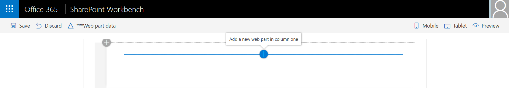
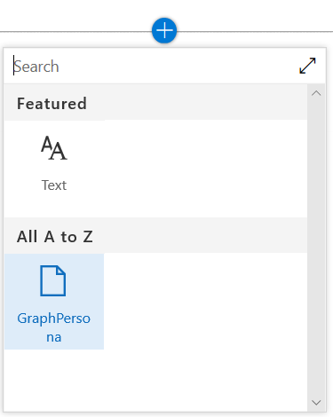

# Leveraging the Microsoft Graph JavaScript SDK from the SharePoint Framework

This module will introduce you to working with the Microsoft Graph REST API to access data in Office 365 using the SharePoint Framework (SPFx). You will build three SPFx client-side web parts in a single SharePoint framework solution.

## In this lab

* [Exercise 1: Show profile details from Microsoft Graph in SPFx client-side web part](#exercise-1-show-profile-details-from-microsoft-graph-in-spfx-client-side-web-part)
* [Exercise 2: Allow use of local Workbench](#exercise-2-allow-use-of-local-workbench)
* [Exercise 3: Implement Unit Test](#exercise-3-implement-unit-test)

## Prerequisites

To complete this lab, you need the following:

* Office 365 tenancy
  * If you do not have one, you obtain one (for free) by signing up to the [Office 365 Developer Program](https://developer.microsoft.com/office/dev-program).
* SharePoint Online environment
  * Refer to the SharePoint Framework documentation, specifically the **[Getting Started > Set up Office 365 Tenant](https://docs.microsoft.com/sharepoint/dev/spfx/set-up-your-developer-tenant)** for the most current steps
* Local development environment with the latest
  * Refer to the SharePoint Framework documentation, specifically the **[Getting Started > Set up development environment](https://docs.microsoft.com/sharepoint/dev/spfx/set-up-your-development-environment)** for the most current steps

## Exercise 1: Show profile details from Microsoft Graph in SPFx client-side web part

In this exercise you will create a new SPFx project with a single client-side web part that uses React, [Fabric React](https://developer.microsoft.com/fabric) and the Microsoft Graph to display the currently logged in user's personal details in a familiar office [Persona](https://developer.microsoft.com/fabric#/components/persona) card.

### Create the Persona SPFx Solution

1. Open a command prompt and change to the folder where you want to create the project.
1. Run the SharePoint Yeoman generator by executing the following command

    > Note: this lab requires the SharePoint Framework version 1.6 or later

    ```shell
    yo @microsoft/sharepoint
    ```

    Use the following to complete the prompt that is displayed:

    * **What is your solution name?**: MSGraphSPFx
    * **Which baseline packages do you want to target for your component(s)?**: SharePoint Online only (latest)
    * **Where do you want to place the files?**: Use the current folder
    * **Do you want to allow the tenant admin the choice of being able to deploy the solution to all sites immediately without running any feature deployment or adding apps in sites?**: No
    * **Which type of client-side component to create?**: WebPart
    * **What is your Web part name?**: GraphPersona
    * **What is your Web part description?**: Display current user's persona details in a Fabric React Persona card
    * **Which framework would you like to use?**: React

    After provisioning the folders required for the project, the generator will install all the dependency packages using NPM.

1. When NPM completes downloading all dependencies, open the project in Visual Studio Code.

### Update Persona Solution Dependencies

1. Install the Microsoft Graph Typescript type declarations by executing the following statement on the command line:

    ```shell
    npm install @microsoft/microsoft-graph-types --save-dev
    ```

1. The web part will use the Fabric React controls to display user interface components. Configure the project to use Fabric React:
    1. Execute the following on the command line to uninstall the SPFx Fabric Core library which is not needed as it is included in Fabric React:

        ```shell
        npm uninstall @microsoft/sp-office-ui-fabric-core
        ```

    1. Configure the included components styles to use the Fabric Core CSS from the Fabric React project.
        1. Open the **src\webparts\graphPersona\components\GraphPersona.module.scss**
        1. Replace the first line:

            ```css
            @import '~@microsoft/sp-office-ui-fabric-core/dist/sass/SPFabricCore.scss';
            ```

            With the following:

            ```css
            @import '~office-ui-fabric-react/dist/sass/_References.scss';
            ```

### Update the Persona Web Part

Update the default web part to pass into the React component an instance of the Microsoft Graph client API:

1. Open the web part file **src\webparts\graphPersona\GraphPersonaWebPart.ts**.
1. Add the following `import` statements after the existing `import` statements:

    ```ts
    import { MSGraphClient } from '@microsoft/sp-http';
    import * as MicrosoftGraph from '@microsoft/microsoft-graph-types';
    ```

1. Locate the `render()` method. This method creates a new instance of a React element by passing in the component class and the properties to bind to it. The only property being set is the `description` property.

    Replace the contents of the `render()` method with the following code to create an initialize a new instance fo the Microsoft Graph client:

    ```ts
    this.context.msGraphClientFactory.getClient()
    .then((client: MSGraphClient): void => {
      const element: React.ReactElement<IGraphPersonaProps> = React.createElement(
        GraphPersona,
        {
          graphClient: client
        }
      );

      ReactDom.render(element, this.domElement);
    });
    ```

### Implement the GraphPersona React Component

1. After updating the public signature of the **GraphPersona** component, the public property interface of the component needs to be updated to accept the Microsoft Graph client:
    1. Open the **src\webparts\graphPersona\components\IGraphPersonaProps.tsx**
    1. Replace the contents with the following code to change the public signature of the component:

        ```ts
        import { MSGraphClient } from '@microsoft/sp-http';

        export interface IGraphPersonaProps {
          graphClient: MSGraphClient;
        }
        ```

1. Create a new interface that will keep track of the state of the component's state:
    1. Create a new file **IGraphPersonaState.ts** and save it to the folder: **src\webparts\graphResponse\components**.
    1. Add the following code to define a new state object that will be used by the component:

        ```ts
        import * as MicrosoftGraph from '@microsoft/microsoft-graph-types';

        export interface IGraphPersonaState {
          name: string;
          email: string;
          phone: string;
          image: string;
        }
        ```

1. Update the component's references to add the new state interface, support for the Microsoft Graph, Fabric React Persona control and other necessary controls.
    1. Open the **src\webparts\graphPersona\components\GraphPersona.tsx**
    1. Add the following `import` statements after the existing `import` statements:

        ```ts
        import { IGraphPersonaState } from './IGraphPersonaState';

        import { MSGraphClient } from '@microsoft/sp-http';
        import * as MicrosoftGraph from '@microsoft/microsoft-graph-types';

        import {
          Persona,
          PersonaSize
        } from 'office-ui-fabric-react/lib/components/Persona';
        import { Link } from 'office-ui-fabric-react/lib/components/Link';
        ```

1. Update the public signature of the component to include the state:
    1. Locate the class `GraphPersona` declaration.
    1. At the end of the line, notice there is generic type with two parameters, the second is an empty object `{}`:

        ```ts
        export default class GraphPersona extends React.Component<IGraphPersonaProps, {}>
        ```

    1. Update the second parameter to be the state interface previously created:

        ```ts
        export default class GraphPersona extends React.Component<IGraphPersonaProps, IGraphPersonaState>
        ```

1. Add the following constructor to the `GraphPersona` class to initialize the state of the component:

    ```ts
    constructor(props: IGraphPersonaProps) {
      super(props);

      this.state = {
        name: '',
        email: '',
        phone: '',
        image: null
      };
    }
    ```

1. Add the Fabric React Persona card to the `render()` method's return statement:

    ```ts
    public render(): React.ReactElement<IGraphPersonaProps> {
      return (
        <Persona primaryText={this.state.name}
                secondaryText={this.state.email}
                onRenderSecondaryText={this._renderMail}
                tertiaryText={this.state.phone}
                onRenderTertiaryText={this._renderPhone}
                imageUrl={this.state.image}
                size={PersonaSize.size100} />
      );
    }
    ```

1. The code in the Persona card references two utility methods to control rendering of the secondary & tertiary text. Add the following to methods to the `GraphPersona` class that will be used to render the text accordingly:

    ```ts
    private _renderMail = () => {
      if (this.state.email) {
        return <Link href={`mailto:${this.state.email}`}>{this.state.email}</Link>;
      } else {
        return <div />;
      }
    }

    private _renderPhone = () => {
      if (this.state.phone) {
        return <Link href={`tel:${this.state.phone}`}>{this.state.phone}</Link>;
      } else {
        return <div />;
      }
    }
    ```

1. The last step is to update the loading, or *mounting* phase of the React component. When the component loads on the page, it should call the Microsoft Graph to get details on the current user as well as their photo. When each of these results complete, they will update the component's state which will trigger the component to rerender.

    Add the following method to the `GraphPersona` class:

    ```ts
    public componentDidMount(): void {
      this.props.graphClient
        .api('me')
        .get((error: any, user: MicrosoftGraph.User) => {
          this.setState({
            name: user.displayName,
            email: user.mail,
            phone: user.businessPhones[0]
          });
        });

      this.props.graphClient
        .api('/me/photo/$value')
        .responseType('blob')
        .get((err: any, photoResponse: any) => {
          const blobUrl = window.URL.createObjectURL(photoResponse);
          this.setState({ image: blobUrl });
        });
    }
    ```

### Update the Persona SPFx Package Permission Requests

The last step before testing is to notify SharePoint that upon deployment to production, this app requires permission to the Microsoft Graph to access the user's persona details.

1. Open the **config\package-solution.json** file.
1. Locate the `solution` section. Add the following permission request element just after the property `includeClientSideAssets`:

    ```json
    "webApiPermissionRequests": [
      {
        "resource": "Microsoft Graph",
        "scope": "User.ReadBasic.All"
      }
    ]
    ```

### Test the Persona Solution

1. Create the SharePoint package for deployment:
    1. Build the solution by executing the following on the command line:

        ```shell
        gulp build
        ```

    1. Bundle the solution by executing the following on the command line:

        ```shell
        gulp bundle --ship
        ```

    1. Package the solution by executing the following on the command line:

        ```shell
        gulp package-solution --ship
        ```

1. Deploy and trust the SharePoint package:
    1. In the browser, navigate to your SharePoint Online Tenant App Catalog.

        >Note: Creation of the Tenant App Catalog site is one of the steps in the **[Getting Started > Set up Office 365 Tenant](https://docs.microsoft.com/sharepoint/dev/spfx/set-up-your-developer-tenant)** setup documentation.

    1. Select the **Apps for SharePoint** link in the navigation:

        

    1. Drag the generated SharePoint package from **\sharepoint\solution\ms-graph-sp-fx.sppkg** into the **Apps for SharePoint** library.
    1. In the **Do you trust ms-graph-sp-fx-client-side-solution?** dialog, select **Deploy**.

        

1. Approve the API permission request:
    1. Navigate to the SharePoint Admin Portal located at **https://{{REPLACE_WITH_YOUR_TENANTID}}-admin.sharepoint.com/_layouts/15/online/AdminHome.aspx**, replacing the domain with your SharePoint Online's administration tenant URL.

        >Note: At the time of writing, this feature is only in the SharePoint Online preview portal.

    1. In the navigation, select **Advanced > API Management**:

        

    1. Select the **Pending approval** for the **Microsoft Graph** permission **User.ReadBasic.All**.

        

    1. Select the **Approve or Reject** button, followed by selecting **Approve**.

        

1. Test the web part:

    >NOTE: The SharePoint Framework includes a locally hosted & SharePoint Online hosted workbench for testing custom solutions. However, the workbench will not work the first time when testing solutions that utilize the Microsoft due to nuances with how the workbench operates and authentication requirements. Therefore, the first time you test a Microsoft Graph enabled SPFx solution, you will need to test them in a real modern page.
    >
    >Once this has been done and your browser has been cookied by the Azure AD authentication process, you can leverage local webserver and SharePoint Online-hosted workbench for testing the solution.

    1. Setup environment to test the web part on a real SharePoint Online modern page:

        1. In a browser, navigate to a SharePoint Online site.
        1. In the site navigation, select the **Pages** library.
        1. Select an existing page (*option 2 in the following image*), or create a new page (*option 1 in the following image*) in the library to test the web part on.

            

            *Continue with the test by skipping the next section to add the web part to the page.*

    1. Setup environment to test the from the local webserver and hosted workbench:
        1. In the command prompt for the project, execute the following command to start the local web server:

            ```shell
            gulp serve --nobrowser
            ```

        1. In a browser, navigate to one of your SharePoint Online site's hosted workbench located at **/_layouts/15/workbench.aspx**

    1. Add the web part to the page and test:
        1. In the browser, select the Web part icon button to open the list of available web parts:

            

        1. Locate the **GraphPersona** web part and select it

            

        1. When the page loads, notice after a brief delay, it will display the current user's details on the Persona card:

            

>Note: If you have multiple identities authenticated in the browser session the web part will fail as it doesn't know which identity to authorize.

## Exercise 2: Allow use of local Workbench
In this exercise you'll modify the web part from exercise 1 to allow testing of the react part using the local workbench.

### Centralize service requests

1. Create the Interface for our service
    1. Create a new file **IGraphPersonaService.ts** and save it to the folder: **src\webparts\graphResponse\components**.
    2. Add the following code to define an interface for our service:

        ```ts
        import { User } from '@microsoft/microsoft-graph-types';
        export interface IGraphPersonaService {
            getProfileInfo():Promise<User>;
            getPhoto():Promise<string>;
        }
        ```
2. Create our service
    1. Create a new file **GraphPersonaService.ts** and save it to the folder: **src\webparts\graphResponse\components**.
    2. Add the following code to implement our service:

        ```ts
        import { User } from '@microsoft/microsoft-graph-types';
        import { IGraphPersonaService } from './IGraphPersonaService';
        import { MSGraphClient } from '@microsoft/sp-http';

        export class GraphPersonaService implements IGraphPersonaService {
            constructor(private graphClient: MSGraphClient) {
            }

            public getProfileInfo(): Promise<User> {
                return this.graphClient
                .api('me')
                .get();
            }
            public getPhoto(): Promise<string> {
                return this.graphClient
                .api('/me/photo/$value')
                .responseType('blob')
                .get()
                .then(res => {
                    return window.URL.createObjectURL(res);
                });
            }
        }
        ```
3. Use the service
    1. Open **src\webparts\graphPersona\components\IGraphPersonaProps.ts**
    2. Replace the contents with the following code to change the public signature of the component:
        ```ts
        import { IGraphPersonaService } from './IGraphPersonaService';
        export interface IGraphPersonaProps {
            service: IGraphPersonaService;
        }
        ```
    > Note: This will break the build
    3. Open the **src\webparts\graphPersona\components\GraphPersona.tsx**
    4. Change the **componentDidMount** method to the following to use the service:
        ```ts
        public componentDidMount(): void {
            this.props.service.getProfileInfo().then (user =>
            {
                this.setState({
                name: user.displayName,
                email: user.mail,
                phone: user.businessPhones[0]
                });
            });
        
            this.props.service.getPhoto().then( photoUrl => 
            {
                this.setState({ image: photoUrl });
            });
        }
        ```
    5. Open the **src\webparts\graphPersona\GraphPersonaWebPart.ts**
    6. Add the following import:
        ```ts
        import { GraphPersonaService } from './components/GraphPersonaService';
        ```
    7. Change the **render** method to the following to provide the service:
        ```ts
        public async render(): Promise<void> {
            var client = await this.context.msGraphClientFactory.getClient();
            var service = new GraphPersonaService(client);
            const element: React.ReactElement<IGraphPersonaProps> = React.createElement(
                GraphPersona,
                {
                    service: service
                }
            );

            ReactDom.render(element, this.domElement);
        }
        ```
4. Test that the web part still works in the Online workbench

### Create an offline dummy service
1. Implement the dummy service
    1. Create a new file **GraphPersonaService.dummy.ts** and save it to the folder: **src\webparts\graphResponse\components**.
    2. Add the following code to implement our dummy service:

        ```ts
        import { User } from '@microsoft/microsoft-graph-types';
        import { IGraphPersonaService } from './IGraphPersonaService';

        export class GraphPersonaService implements IGraphPersonaService {
            constructor() {
            }

            public getProfileInfo(): Promise<User> {
                return Promise.resolve({
                    "@odata.context": "https://graph.microsoft.com/v1.0/$metadata#users/$entity",
                    "id": "48d31887-5fad-4d73-a9f5-3c356e68a038",
                    "businessPhones": [
                        "+1 412 555 0109"
                    ],
                    "displayName": "Megan Bowen",
                    "givenName": "Megan",
                    "jobTitle": "Auditor",
                    "mail": "MeganB@M365x214355.onmicrosoft.com",
                    "mobilePhone": null,
                    "officeLocation": "12/1110",
                    "preferredLanguage": "en-US",
                    "surname": "Bowen",
                    "userPrincipalName": "MeganB@M365x214355.onmicrosoft.com",
                    // The following are erroneously required
                    "assignedLicenses": [],
                    "assignedPlans": [],
                    "provisionedPlans": [],
                    "proxyAddresses": [],
                    "birthday": null,
                    "hireDate": null,
                    "deviceEnrollmentLimit": 0
                });
            }
            public getPhoto(): Promise<string> {
                return Promise.resolve("https://localhost:4321/megan.jpg");
            }
        }
        ```
    3. Save an image like this as **megan.jpg** in the root folder  
    

### Load the dummy service
1. If in the local workbench load the dummy service (as a seperate bundle)
    1. Open the **src\webparts\graphPersona\GraphPersonaWebPart.ts**
    2. Change the import from **@microsoft/sp-core-library** to the following:
        ```ts
        import { Version, Environment, EnvironmentType } from '@microsoft/sp-core-library';
        ```
    3. Add the following import:
        ```ts
        import { IGraphPersonaService } from './components/IGraphPersonaService';
        ```
    4. Change the **render** method to the following to load the dummy service:
        ```ts
        public async render(): Promise<void> {
            var service : IGraphPersonaService;
            if (Environment.type == EnvironmentType.Local) {
                service = new (await import(/* webpackChunkName: 'dummyservice' */'./components/GraphPersonaService.dummy')).GraphPersonaService();
            } else {
                var client = await this.context.msGraphClientFactory.getClient();
                service = new GraphPersonaService(client);
            }
            const element: React.ReactElement<IGraphPersonaProps> = React.createElement(
                GraphPersona,
                {
                    service: service
                }
            );

            ReactDom.render(element, this.domElement);

        }
        ```
### Test in local workbench
1. In the command prompt for the project, execute the following command to start the local workbench:

    ```shell
    gulp serve
    ```
2. Wait for the local workbench to open
3. Add the web part to the page and test:
    1. In the browser, select the Web part icon button to open the list of available web parts:

        

    2. Locate the **GraphPersona** web part and select it

        

    3. When the page loads, notice after a brief delay, it will display Megans details ocoden the Persona card:

        
4. Test that the web part still works in the Online workbench


## Exercise 3: Implement Unit Test
In this exercise you'll implement a simple Unit test of the react part of the web part from exercise 1 and 2.

### Prepare project for unit testing using Jest
1. Install the Jest unit test libraries by executing the following statement on the command line:

    ```shell
    npm install --save-dev jest ts-jest@23.0.1 @types/jest enzyme enzyme-adapter-react-15 react-test-renderer @types/enzyme
    ```
2. Change test runner to be Jest
    1. Open **package.json**
    2. Change the **test** command in **scripts** to be:
    ```json
    "test": "jest -c"
    ```
 3. Create a new file **jest.config.js** and save it to the root folder.
 4. Add the following code to configure jest:
    ```js
    module.exports = {
        moduleFileExtensions: [
            'ts',
            'tsx',
            'js',
            'jsx',
            'json'
        ],
        transform: {
            '^.+\\.tsx?$': 'ts-jest'
        },
        moduleNameMapper: {
            '^@/(.*)$': '<rootDir>/src/$1',
        },
        testMatch: [
            '<rootDir>/(tests/unit/**/*.test.(js|jsx|ts|tsx)|src/**/*.test.(js|jsx|ts|tsx))'
        ]
    }
    ```
5. Open **tsconfig.js**
6. Add `jest` to the **types** array so it becomes:
    ```js
    "types": [
      "es6-promise",
      "webpack-env",
      "jest"
    ],
    ```
7. If you want to test using [Wallaby.js](https://wallabyjs.com/) add **wallaby.js** with the following content:
    ```js
    module.exports = wallaby => {

        return {
            files: ['src/**/*', 'jest.config.js', 'package.json', 'tsconfig.json', 'tests/**/*' , '!src/**/*.test.ts', '!tests/**/*.test.ts',
                {pattern: 'node_modules/enzyme-adapter-react-15/**/*', instrument: false},
            ],

            tests: ['tests/**/*.test.ts','src/**/*.test.ts'],

            env: {
                type: 'node',
                runner: 'node',
            },
            
            preprocessors: {
            },

            compilers: {
                '**/*.ts?(x)': wallaby.compilers.typeScript({
                    module: 'commonjs',
                    jsx: 'React'
                })
            },

            setup(wallaby) {
                const jestConfig = require('./package').jest || require('./jest.config')
                delete jestConfig.transform['^.+\\.tsx?$']
                Object.keys(jestConfig.moduleNameMapper).forEach(k => (jestConfig.moduleNameMapper[k] = jestConfig.moduleNameMapper[k].replace('<rootDir>', wallaby.localProjectDir)))
                wallaby.testFramework.configure(jestConfig)
            },

            testFramework: 'jest',

            debug: true
        }
    }
    ```
### Verify that our test setup is working
1. Create a new file **GraphPersona.test.ts** and save it to the folder: **src\webparts\graphResponse\components**.
2. Add the following code to verify our test setup:
    ```ts
    describe('Unit test setup', () => {
        it("should work", () => {
            expect(2+2).toBe(4);
        });
    });
    ```
3. Run unit tests by executing the following statement on the command line:

    ```shell
    npm test -- --watch
    ```

### Implement real tests
1. Verify that we can start react component
    1. Open **src\webparts\graphPersona\components\GraphPersona.test.ts**
    2. Implement a real test by changing the content to:
        ```ts
        import * as React from 'react';
        import { configure, mount, ReactWrapper } from 'enzyme';
        import * as Adapter from 'enzyme-adapter-react-15';
        configure({ adapter: new Adapter() });

        import GraphPersona from "./GraphPersona";
        import { IGraphPersonaProps } from './IGraphPersonaProps';
        import { IGraphPersonaState } from './IGraphPersonaState';
        import { IGraphPersonaService } from './IGraphPersonaService';
        describe("GraphPersona", () => {
            let reactComponent: ReactWrapper<IGraphPersonaProps, IGraphPersonaState>;
            let getProfileInfoPromiseResolve;
            let getProfileInfoPromiseReject;
            beforeEach(() => {
                // Implement test service
                let service: IGraphPersonaService = {
                    getProfileInfo() {
                        return new Promise((resolve, reject) => {
                            getProfileInfoPromiseResolve = resolve;
                            getProfileInfoPromiseReject = reject;
                        });
                    },
                    getPhoto() {
                        return Promise.resolve("http://myhost/myimage.jpg");
                    }
                };
                // Mount react component
                reactComponent = mount(React.createElement(
                    GraphPersona,
                    {
                        service: service
                    }
                ));
            });

            afterEach(() => {
                reactComponent.unmount();
            });

            it("Should load with empty persona", () => {
                const element = reactComponent.find('.ms-Persona-primaryText');
                expect(element.length).toBeGreaterThan(0);
                expect(element.text()).toEqual("");
            });
        });
        ```
    3. Watch the test run when you save the file (or before if using Wallaby.js)
    4. Fix the warnings issued:
        1. Open **src\webparts\graphPersona\components\GraphPersona.tsx**
        2. Add the following import and initialize call:
            ```ts
            import { initializeIcons } from 'office-ui-fabric-react/lib/Icons';
            initializeIcons();
            ```
        3. Change `primaryText` to `text`
    5. Verify that the test pass without warnings
2. Add the following more advanced test:
    ```ts
    it("Should show real name when resolved", async () => {
      const element = reactComponent.find('.ms-Persona-primaryText');
      expect(element.length).toBeGreaterThan(0);
      expect(element.text()).toEqual("");
      getProfileInfoPromiseResolve({
        "businessPhones": [
          "+1 412 555 0109"
        ],
        "displayName": "Megan Bowen",
        "mail": "MeganB@M365x214355.onmicrosoft.com",
      });
      await reactComponent.update();
      expect(element.text()).toEqual("Megan Bowen");
    });
    ```
3. Verify that the tests still pass
### TDD - Test Drive Development
1. Add the following test of new important functionality:
    ```ts
    it("Should possible to beautify name", async () => {
      const element = reactComponent.find('.ms-Persona-primaryText');
      expect(element.length).toBeGreaterThan(0);
      expect(element.text()).toEqual("");
      getProfileInfoPromiseResolve({
        "businessPhones": [
          "+1 412 555 0109"
        ],
        "displayName": "Megan Bowen",
        "mail": "MeganB@M365x214355.onmicrosoft.com",
      });
      await reactComponent.update();
      expect(element.text()).toEqual("Megan Bowen");
      const button = reactComponent.find("button");
      button.simulate('click');
      expect(element.text()).toEqual("Per Jakobsen");  
    });
    ```
2. Verify that the last test fails
3. Implement the missing functionality
    1. Open **src\webparts\graphPersona\components\GraphPersona.tsx**
    2. Change the **render** method to the following:
        ```ts
        public render(): React.ReactElement<IGraphPersonaProps> {
            return (
                <div>
                    <Persona text={this.state.name}
                            secondaryText={this.state.email}
                            onRenderSecondaryText={this._renderMail}
                            tertiaryText={this.state.phone}
                            onRenderTertiaryText={this._renderPhone}
                            imageUrl={this.state.image}
                            size={PersonaSize.size100} />
                    <button onClick={() => this.setState({name: "Per Jakobsen"})} >Beautify name</button>        
                </div>
            );
        }
        ```
4. Verify that all tests now pass
5. Verify that the new important functionality is working in the workbenches